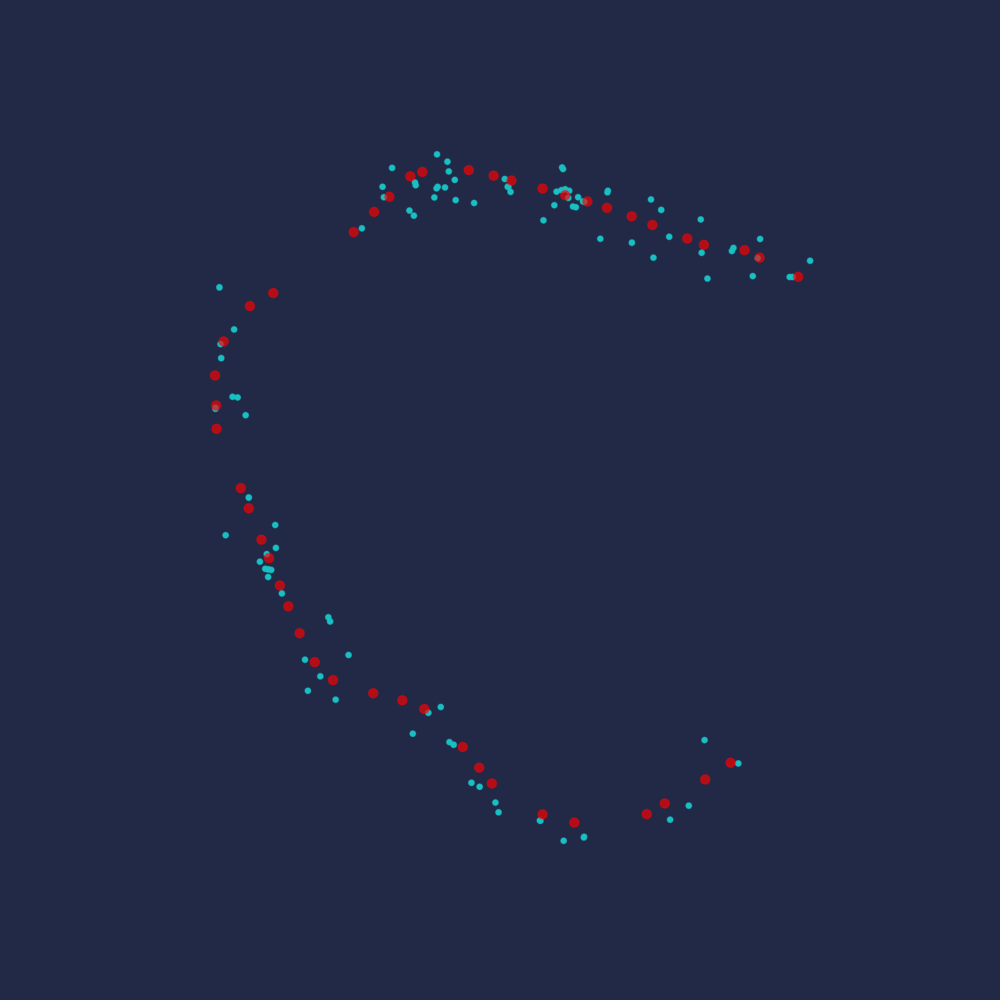
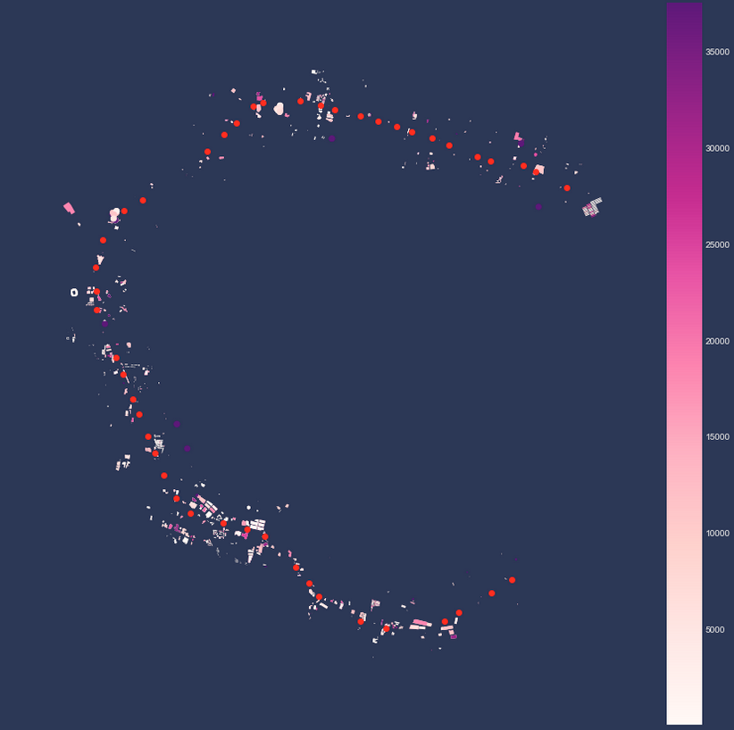
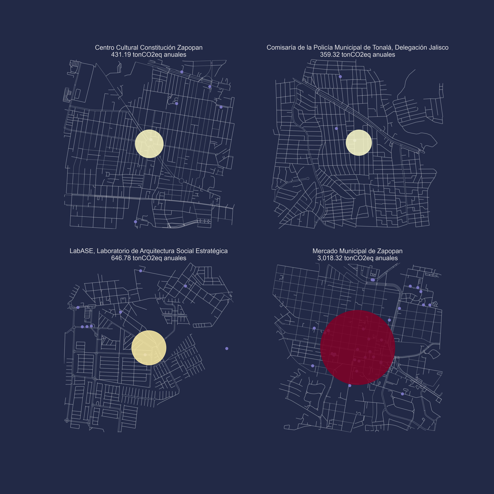
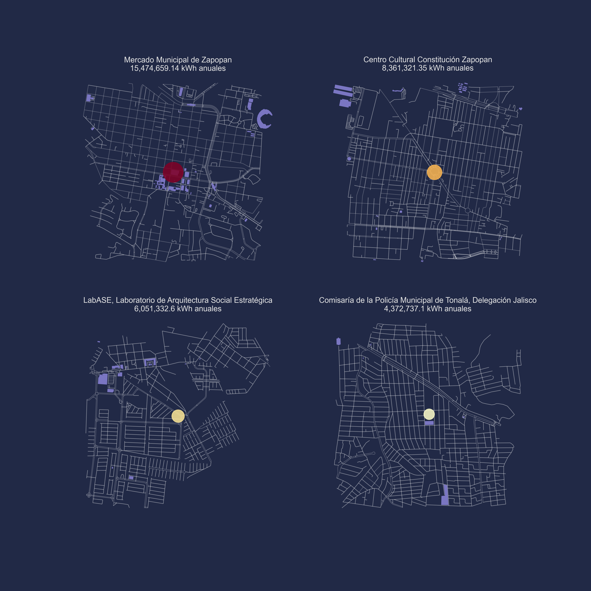
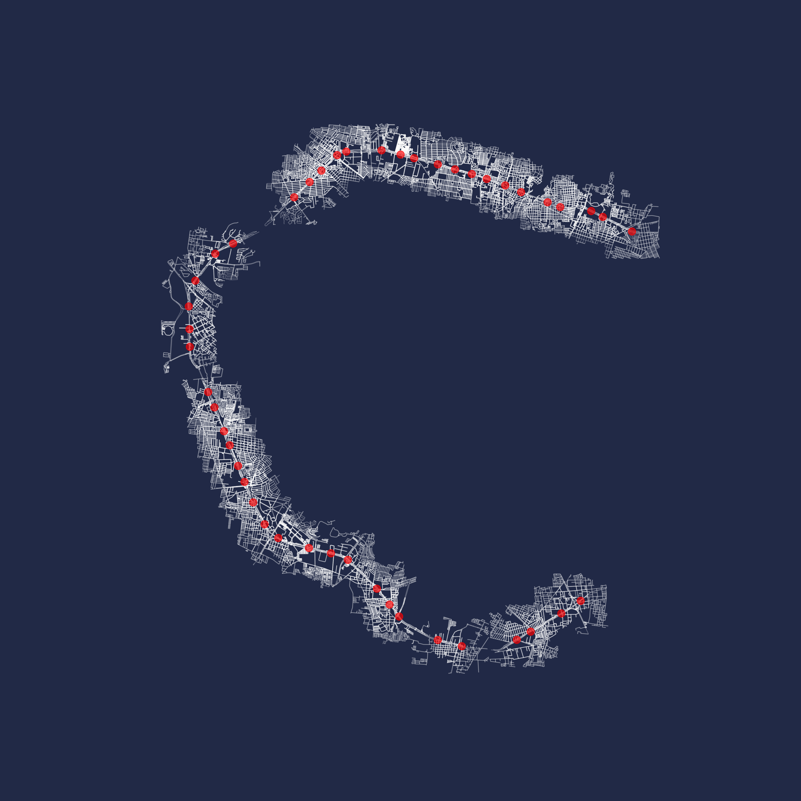
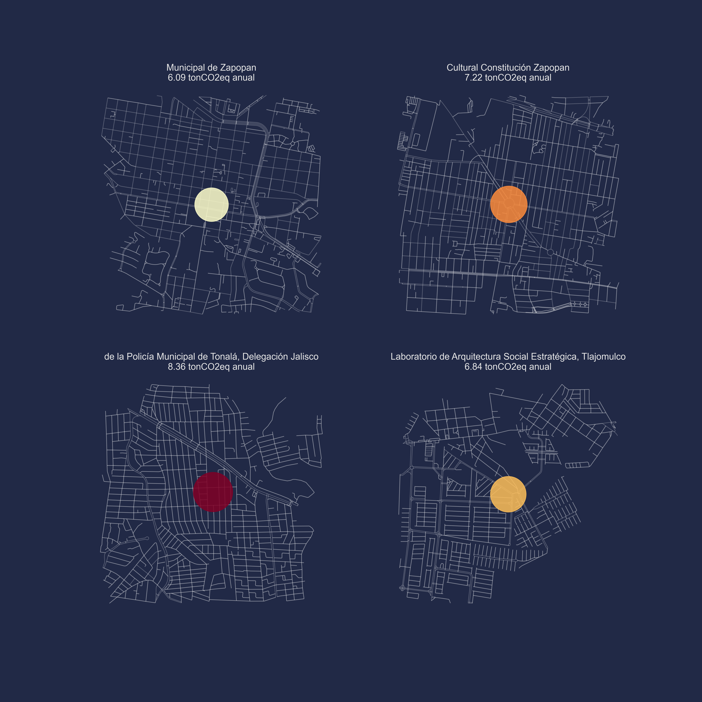

# Análisis

[Inicio](../../README.md)
***

En esta sección se detallan los análisis que se realizaron a los datos y la forma en la que se trabajó (ver [Datos](data.md) para una revisión de donde vienen los datos y su procesamiento). Se realizaron tres análisis para tener una línea base de los contaminantes y potencial solar en las estaciones de Mi Macro Periférico.

## 1.- Calidad del aire

Con el objetivo de realizar una línea base para la medición de contaminantes en las estaciones del sistema BRT Mi Macro Periférico, diseñamos una metodología que nos permitiera estimar la calidad del aire en las 46 estaciones del sistema a partir de bases de datos existentes.

El primer paso fue investigar los datos y opciones de interacción con la plataforma de [Google.org Environmental Insights Explorer](https://insights.sustainability.google/), la plataforma tiene datos sobre emisiones de contaminantes y calidad del aire a nivel municipal, sin embargo, estos datos no pueden ser utilizados para estimar la contaminación a nivel de las estaciones del sistema BRT ya que las dinámicas de calidad del aire varían a lo largo del territorio.

Para subsanar la falta de datos granulares, se utilizaron los datos de las estaciones de monitoreo de calidad del aire del Área Metropolitana de Guadalajara como punto de partida. El procedimiento para la interpolación fue el siguiente:

1. Descarga de plano base de Guadalajara  
1. Ubicación de estaciones de Mi Macro Periférico  
1. Ubicción de las estaciones de monitoreo.

A partir de las ubicaciones generamos dos interpolaciones:

1. Interpolación en retícula que cubre el área de las estaciones del sistema estatal de monitoreo y las estaciones de Mi Macro Periférico.
1. Interpolación de valores de contaminantes en las estaciones de monitoreo. El código que se utilizó está disponible en [08-interpolate-mimacro.py](../../scripts/08-interpolate-mimacro.py)

### **1.1.- Interpolación en retícula**

El resultado de la primera interpolación nos permitió crear visualizaciones para entender las dinámicas de calidad del aire en la zona de estudio como la que se muestra a continuación:

Esta visualización (y las disponibles en la carpeta [gif](../gif))nos permite observar como varía la calidad del aire en las diferentes zonas de la ciudad a partir de utilizar solamente los datos disponibles de las estaciones de monitoreo. Si bien no se consideran factores como la disperción de contaminantes por viento y otros factores climáticos, la interpolación de datos permite tener un estimado de los niveles de contaminantes de manera granular para la ciudad.

### **1.2.- Interpolación por estaciones**

La segunda interpolación de los valores la realizamos sobre las estaciones de Mi Macro Periférico, para obtener los valores históricos en cada estaciones y mostrar una línea base histórica de los niveles de contaminación anteriores a la entrada en marcha del sistema de transporte masivo.

Para cada una de las estaciones realizamos el cálculo de su línea base (disponibles en la carpeta [estmacro](../figures/estmacro)), el cual, en un panel, muestra la ubicación de la estación, y los niveles de contaminación (promedio semanal) del primero de Enero del 2014 al 31 de Diciembre del 2019. Al incluir un espectro de cinco años, nos permite observar la tendencia y ciclos de los contaminantes analizados.

Con esta información es posible tener un punto de partida para el análisis de los nuevos datos que se contemplan recabar como parte del proyecto PIP Ciudad Futuro.

### **1.3.- Siguientes pasos**

Esta etapa consistió en utilizar los datos disponibles de las estaciones del Sistema de Monitoreo Atmosférico de Jalisco. Sin embargo, para afinar la medición y línea de monitoreo de en las estaciones se sugieren diversas rutas de acción:

+ **API calidad del aire.** Para facilitar el uso de los datos públicos de calidad del aire, se sugiere el desarrollo de una interfaz de programación (API) para la consulta directa de los datos.

+ **Datos Google.org.** La plataforma Environmental Insights Explorer de Google.org ofrece la función de revisar la metodología que utilizaron para los cácluos ambientales. Sin embargo, no hay acceso a los datos georeferenciados utilizados para el cálculo de sus indicadores. Sería necesario contar con los datos más granulares posibles para contrastar y mejorar los resultados obtenidos.

## 2.- Emisiones de edificios

Se realizó un cálculo de las emisiones estimadas de toneladas de CO₂ equivalente en los edificios gubernamentales aledaños a las estaciones de MiMacro Periférico y los puntos de interés definidos con el equipo de PIP con el objetivo de identificar el impacto que tienen estos espacios en el cambio climático y establecer una primera línea base que posteriormente se pueda utilizar para definir objetivos de reducción de emisiones.

### **2.1.- Cálculo de emisiones**

Debido a que no se tiene la información gubernamental abierta al público sobre el consumo energético por edificación se tuvieron que diseñar otras rutas de acceso a los datos aprovechando los datos que sí están publicados y plataformas de datos abiertos para realizar cruces de información y así estimar los valores de emisión. A continuación se detallan los pasos:

+ Localización de edificios gubernamentales: El primer paso fue obtener la ubicación de los sitios gubernamentales utilizando la base de datos georreferenciada del [Directorio Estadístico de Unidades Económicas](https://www.inegi.org.mx/app/descarga/?ti=6) y filtrando los códigos con actividades gubernamentales (931).

+ Filtrado de edificios gubernamentales: Posteriormente, fue necesario extraer los edificios gubnernamentales que sí se encontraban dentro del área de influencia (1000m) de las estaciones. Para esto se hizo un recorte de los puntos dentro de los buffers.

+ Descarga de edificaciones: Utilizando la base de datos de [OpenStreetMap](https://www.openstreetmap.org/#map=6/23.944/-102.579) y el módulo [OSMnx](https://osmnx.readthedocs.io/en/stable/) para Python se descargaron los edificios construidos en el área de influencia de las estaciones.

+ Estimación del área de edificios gubernamentales: Se intentó generar un cruce de los datos del DENUE con los de OSM para obtener la información de los m² construidos en los edificios gubernamentales. Sin embargo, no se identificaron coincidencias. Por lo tanto, fue necesario estimar el área de estos espacios calculando el área promedio de los edificios que sí tenían información en las zonas de influencia, este valor (2122m²) fue utilizado en cálculos posteriores como el área de cada punto.

+ Cálculo del consumo energético: Con el dato de m² estimados de edificios gubernamentales para cada estación de MiMacro Periférico y puntos de interés se realizó el cálculo del consumo energético, multiplicando los m² con la estimación de consumo de [Google.org Enviromental Insights Explorer](https://insights.sustainability.google/places/ChIJOwV0Q_qxKIQR7NCkjDwfR-k/buildings) para edificaciones no residenciales (144.06kWh/m²/yr).

+ Cálculo de emisiones: Por último, el consumo energético por edificio en unidades kWh/yr se multiplicó por la estimación de emisiones de CO₂ de [Google.org Enviromental Insights Explorer](https://insights.sustainability.google/places/ChIJOwV0Q_qxKIQR7NCkjDwfR-k/buildings) (0.00041423tCO₂e/kWh). Como se mencionó previamente, este valor se obtuvo para cada estación de MiMacro Periférico y punto de interés.

#### **2.1.1.- Limitantes**

Como se describió en la metodología, los datos de m² para cada edificio gubernamental fueron calculados a partir del promedio de los edificios con los que sí se contaba información en las áreas de influencia. Además, debido a que los datos de consumo energético son estimaciones de Google, se pierde el detalle que puede tener en la realidad un edificio con mayor área comparado con uno de menor.

### **2.2.- Siguientes pasos**

La información del consumo energético detallado de los edificios de gobierno puede ser abierta al público utilizando una API orientada a comunicar a la población en general acerca del impacto de la operación gubernamental en el cambio climático.

En caso de que las instancias gubernamentales no monitoreen estos datos actualmente, se considera que sería de gran utilidad definir un proyecto que lo contemple, de tal manera que se cuente con una línea base más sólida para justificar la implementación de estrategias de ahorro energético o cambio a energías renovables.

## 3.- Potencial Solar

Parte del análisis de la línea base de contaminantes incluyó calcular el potencial solar de las áreas de estudio, para hacer el cálculo se tomaron en cuenta las estimaciones de Google.org sobre el potencial solar medio de Guadalajara.

### **3.1.- Cálculo potencial**

El cálculo del potencial solar se realizó de la siguiente manera:

+ Descarga de las áreas de los edificios dentro del polígono de estudio (radio de 1km de las estaciones de Mi Macro Periférico o puntos de interés)
+ Suma de las áreas
+ Multiplicamos la suma de las áreas en m2 por el potencial solar annual medio de un metro cuadrado (235.71 kWh anual)
+ Por ejemplo para un área de estudio con 10 edificios de 10m2 de azotea cada uno el potencial es:
  + Área total = 100 m2
  + Potencial = 235.71 kWh
  + Total = Área total x Potencial = 23,571 kWh anual

Utilizando este cálculo obtivimos los siguientes resultados para cada una de las estaciones y puntos de interés:

#### 3.1.1.- Limitantes

Es importante mencionar que el cálculo es un estimado, ya que depende de contar con las áreas de azotea disponibles, que en este caso provienen de Open Street Maps, y aunque el servicio contiene datos sobre algunas edificaciones, no todas las edificaciones están mapeadas.

### **3.2.- Siguientes pasos**

Con el objetivo de mejorar el cálculo de la línea base se sugiere utiliziar información más actualizada sobre las azoteas en las áreas de estudio. Una primera oportunidad es utilizar datos catastrales que puedan ser otorgados por los gobiernos municipales.

Si el proyecto sigue de la mano de Google.org se sugiere buscar un acercamiento para obtener los datos relevantes sobre las azoteas, estos datos pueden ser obtenidos desde los sistemas de mapas de Google, como Google Maps o Google Earth. Con la habilitación de una API se puede solucionar el consumo de estos datos y su integración al análisis.

## 4.- Emisiones de transporte

Para dimensionar el impacto que tendrá MiMacro Periférico se realizó una estimación de las emisiones por transporte en las áreas de influencia de cada estación.

### **4.1.- Cálculo contaminación**

El cálculo de las emisiones de toneladas de CO₂ equivalente por transporte en las áreas de influencia de las estaciones se realizó de la siguiente manera:

+ Descarga de vialidades: Utilizando la base de datos de [OpenStreetMap](https://www.openstreetmap.org/#map=6/23.944/-102.579) y el módulo [OSMnx](https://osmnx.readthedocs.io/en/stable/) para Python se descargaron las vialidades en el área de influencia de las estaciones.

+ Longitud de vialidades: A partir de las vialidades descargadas se realizó un recorte de aquellas que se encontraban dentro del área de influencia (1000m) de las estaciones. Posteriormente, se calculó la longitud de las vialidades (m), para esto fue necesario recalcular las longitudes de las vialidades tras realizar el recorte.

+ División de estación por municipio: Con información del [Marco Geoestadístico de INEGI](https://www.inegi.org.mx/temas/mg/default.html#Descargas) se hizo una unión espacial con las estaciones y sitios de interés para concer en qué municipio (Guadalajara, Zapopan, Tonalá, Tlajomulco de Zúñiga o San Pedro Tlaquepaque) se encontraba cada una.

+ Reparto modal: Se utilizaron los repartos modales, eficiencia de los vehículos y emisiones de toneladas de CO₂ por litro de combustible de [Google.org Environmental Insights Explorer](https://insights.sustainability.google/places/ChIJOwV0Q_qxKIQR7NCkjDwfR-k/transportation) para automóviles, transporte público y motocicletas. Debido a que no se obtuvieron datos de Zapopan, Tonalá y Tlajomulco de Zúñiga se realizaron promedios de los valores de San Pedro Tlaquepaque y Guadalajara.

+ Cálculo de consumo de combustible: Para cada método de transporte analizado se multiplicó la distancia en kilómetros de cada estación por el porcentaje del reparto y posteriormente por la eficiencia promedio.

+ Cálculo de emisiones: Con el consumo de litros por método de transporte se multiplicó este valor por la emisión estimada promedio por litro de combustible. Los valores de cada método de transporte se sumaron. Debido a que las emisiones son para la distancia y no tienen una temporalidad, se asumió que los datos de Google representan un día promedio. Con base en esto cada valor se multiplicó por 265, una estimiación de los días hábiles en un año.

+ Ejemplo: a continuación se muestra un ejemplo del cálculo realizado:

10 km en estación <em>x</em> * 0.8 (porcentaje de transporte en automóvil para Guadalajara) / 9.1 (eficiencia promedio de los automóviles) * 0.002 (emisiones en toneladas de CO₂ por litro de combustible) * 265 días hábiles

#### **4.1.1.- Limitantes**

Los datos que se utilizaron del reparto modal de Google representan un promedio para todo el municipio (acotando que solo se tuvo acceso a la información de Guadalajara y San Pedro Tlaquepaque), sin embargo, es posible que en las áreas de influencia de las estaciones estas sean distintas. Además, el reparto modal que se utilizó para estimar las emisiones no contempla la carga vehicular de cada vialidad y asume que esta se divide de forma uniforme en todo el municipio.

### **4.2.- Siguientes pasos**

Es posible aprovechar los datos de tráfico que tiene Google para estimar de forma más certera la carga de las vialidades en las áreas de influencia y definir una línea base de emisiones más apeagada a la realidad. Además, los embotellamientos hacen que se reduzca la eficiencia de consumo del combustible, así que no solamente se puede obtener una mejor estimación por la carga de la vialidad sino por la congestión de los vehículos en la zona.

## 5.- Línea base de CO2 equivalente

A partir de los datos que se recopliaron con los sensores de [Smart Citizen](https://smartcitizen.me/kits/) del proyecto de [Prototipos de Infraestructura Pública para una Ciudad del Futuro](https://pipciudadfuturo.com/) se busca generar un primer acercamiento a la elaboración de una línea base de CO2 equivalente.

### **5.1.- Línea base**

Los datos históricos para los sensores se descargaron desde la api de Smart Citizen y se encuentran disponibles en la base de datos de PIP de forma abierta. Una descripción más detallada del método de acceso a la información se encuentra en [Datos](data.md).

A partir de los datos descargados de la base de datos se pueden analizar los dispositivos y parámetros disponibles. Para la línea base se utilizaron todos los dispositivos, pero únicamente el parámetro de Equivalent Carbon Dioxide Digital Indoor Sensor.

Con estos filtros establecidos se debe de hacer una agrupación del promedio de los datos por día debido a que los datos de Smart Citizen tienen una resolución temporal horaria (e incluso con más detalle en algunas ocasiones), lo que dificultaría el análisis de los datos. Tras realizar la agrupación se grafican las concentraciones como una dispersión de puntos conectados por una línea punteada. La línea permite que sea más fácil darle un seguimiento visual a los datos. A su vez, cada punto se acompaña de una barra lateral que muestra una desviación estándar de los valores promedio para comunicar el comportamiento registrado por los sensores a lo largo del día. 

En el mapa de la izquierda se puede observar la localización del sensor Smart Citizen analizado con respecto a los otros sensores en el AMG.

En las gráficas resultantes es posible observar que hay dos formatos, uno que contiene solo una gráfica con valores de CO2 y otra con dos. Esto se debe a que, al analizar los datos pudimos notar que casi todos los sensores dejan de registrar valores a partir de marzo 2021, sin embargo, algunos de estos retoman registros en junio 2021. Esto hizo que hubiera un hueco en los registros y, además de que fuera visualmente confuso, reducía el espacio de la gráfica y no permitía leerla claramente. Para atender esta circunstancia se dividieron los formatos, en las figuras que se muestran dos gráficas de dispersión se retomaron las mediciones en junio y son las que se muestran a la derecha, si solo hay una gráfica el sensor no retomó mediciones. Esta información se puede corroborar en los títulos de lagr gráficas que indican las fechas que se están mostrando y en las etiquetas de las x en la gráfica.

#### 5.1.1.- Limitantes

La irregularidad en la captura de los datos dificulta validar estadísticamente su agrupación en distintas temporalidades (por ejemplo por día o por semana). Además, para poder entender y analizar los datos que se muestran en las gráficas sería relevante conocer si los sensores se encuentran colocados en espacios con la ventilación necesaria, o incluso si están al aire libre o dentro del hogar.

### **5.2.- Siguientes pasos**

Dar seguimiento a la captura de los datos es relevante para la continua construcción de la base de datos e incrementar la capacidad de análisis de la información. Los huecos en los datos dificultan su interpretación y comunicación a la comunidad.

## 6.- Comparativa de datos de PM10 entre Smart Citizen y la Semadet

Utilizando los datos que se recopliaron con los sensores de [Smart Citizen](https://smartcitizen.me/kits/) y los datos interpolados de de las estaciones de monitoreo de la Secretaría de Medio Ambiente y Desarrollo Territorial del Estado de Jalisco (Semadet) se realizaron comparaciones gráficas y estadísticas de las concentraciones para PM10. Los datos con los que se trabaja fueron recopilados del portal de la api de Smart Citizen y del portal de la Seamdet y se encuentran guardados en la base de datos del proyecto [Prototipos de Infraestructura Pública para una Ciudad del Futuro](https://pipciudadfuturo.com/). Sin embargo, actualmente no se tiene acceso a los datos 2021 de la Semadet, mientras que solo se tienen valores 2021 para Smart Citizen, por lo que lo que se muestra a continuación es un ejemplo aplicado con las interpretaciones esperadas.

### **6.1.- Comparativa gráfica y estadística**

Los datos históricos para los sensores se descargaron desde la api de Smart Citizen y se encuentran disponibles en la base de datos de PIP de forma abierta, de igual forma, los datos tratados de la Semadet se obtuvieron de la misma base de datos. Una descripción más detallada del método de acceso a la información se encuentra en [Datos](data.md).

Como se mencionó antes, debido a que los datos registrados por Smart Citizen son para el año 2021 y los datos de la Semadet únicamente se encuentran publicados hasta el año 2019 es necesario consrtuir un ejemplo de la metodología para el desarrollo del método comparativo de los datos, si bien las conclusiones que se generen de este no van a ser adecuadas sí marcan la ruta de qué pasos se deben de seguir y cómo se debe de interpretar la información.

Se tuvo que dar un tratamiento a los datos de Smart Citizen para evitar tener valores duplicados en una sola hora. Para esto se agrupó la información y en caso de identificar valores dobles se calculó su promedio y este fue el dato que se mantuvo.

Para el ejemplo se creó una fecha temporal para datos del 2018 con la información recopilada por los sensores Smart Citizen (aunque en realidad son los registros 2021). Esto quiere decir que el día y mes se mantiene igual y solamente cambia el año. Esto nos permite comparar la información de la misma fecha pero del 2018 de la Semadet.

Con esta información se utilizó el método de interpolación que se describe en la sección 1.2 para calcular un valor estimado por la Semadet para la ubicación del sensor de Smart Citizen. Por lo tanto, en cada hora de registro de Smart Citizen se tiene un valor estimado de la concentración de PM10 a partir de los datos de la Semadet.

Estos grupos de datos nos permiten graficar su dispersión para observar sus comportamientos, pero el análisis se complementa con estadísticos de análisis. Los estadísticos son:
+ Coeficiente de correlación de Pearson: que nos indica si existe una correlación entre ambas series de valores.
+ Raíz del error cuadrático medio: representa la dispersión que hay entre la diferencia de los valores individuales. Tomando como verdadero el valor interpolado y estimado el de Smart Citizen.
+ Prueba t de Student: indica si hay una diferencia estadísticamente significativa entre las medias de dos poblaciones.

En el mapa de la izquierda se muestra la ubicación del sensor de Smart Citizen en comparación con los sensores de la Semadet. Por su parte, en la gráfica, o gráficas, de dispersión de la derecha se representan los valores interpolados contra los registrados por Smart Citizen. 

En las gráficas resultantes es posible observar que hay dos formatos, uno que contiene solo una gráfica con valores registrados de PM10 y otra con dos. Esto se debe a que, al analizar los datos pudimos notar que casi todos los sensores dejan de registrar valores a partir de marzo 2021, sin embargo, algunos retoman registros en junio 2021. Esto hizo que hubiera un hueco en los registros y, además de que fuera visualmente confuso, reducía el espacio de la gráfica y no permitía leerla claramente. Para atender esta circunstancia se dividieron los formatos, en las figuras que se muestran dos gráficas de dispersión se retomaron las mediciones en junio y son las que se muestran a la derecha, si solo hay una gráfica el sensor no retomó mediciones. Esta información se puede corroborar en los títulos de lagr gráficas que indican las fechas que se están mostrando y en las etiquetas de las x en la gráfica.

Además, en la gráfica de dispersión se puede observar los resultados de los datos estadísticos del coeficiente de correlación, la raíz del error cuadrático medio y la prueba t de Student.

La interpretación de los datos estadísticos es la siguiente:
+ Coeficiente de correlación de Pearson: este valor va entre -1 y 1, donde 1 muestra una correlación positiva y un valor cercano a esto es lo que se esperaría encontrar para los datos entre Smart Citizen y la Semadet. Por su parte, una correlación negativa (-1) o más aun, una correlación inexistente (con valores cercanos a cero) indicarían que los valores no tienen la relación esperada, considerando que se trata del mismo contaminante.
+ Raíz del error cuadrático medio: este dato muestra el valor residual entre los registros interpolados de la Semadet y Smart Citizen, este valor nos indica la magnitud del error, donde un valor menor representa un error (o diferencia) menor.
+ Prueba t de Student: esta prueba nos permite evaluar si la diferencia entre dos medias es estadísticamente significativa, en este caso, el valor que se muestra es el valor de p, que indica la probabilidad de que el estadístico calculado (la Prueba t de Student) sea correcto dada la hipótesis nula. En este caso, la hipótesis nula es que no hay diferencia estadísticamente significativa entre ambas medias, por lo que, con un valor de p mayor a 0.05 no se rechaza esta hipótesis. Al contrario, si el valor de p es menor a 0.05 se acepta la hipótesis nula de que las medias son estadísticamente distintas. Para este caso esperaríamos encontrar un valor de p mayor a 0.05.

Algunas consideraciones relevantes son que los valores interpolados tampoco representan un valor certero de la concentración en un punto cualquiera de la ciudad, son simplemente una estimación de la concentración a partir de los datos conocidos, por lo que puede que no registren la realidad de la dinámica atmosférica de un sitio de forma certera. Por este motivo, si el sensor de Smart Citizen se encuentra fuera del área de influencia de las estaciones se reduce la confiabilidad del valor interpolado. Por otro lado, se desconoce la localización de los sensores de Smart Citizen, esto quiere decir, que si se encuentran al aire libre en un sitio que permita el flujo del aire sin obstrucciones. Debido a que este es uno de los requerimientos para los sensores de la Semadet, en caso de que no se cumpla se puede afectar la medición registrada por el sensor de Smart Citizen y ocasionar desviaciones con respecto al valor oficial.

#### 6.1.1.- Limitantes

La principal limitante es, como ya se mencionó, la ausencia de datos para el año 2021 por parte de la Semadet. Aunado a esto, la irregularidad en la captura de los datos por parte de los sensores Smart Citizen dificultan su análisis y, si no se conoce su localización, se puede reducir la representativdad de la comparación estadística de la información.

### **6.2.- Siguientes pasos**

La solicitud y el acceso a los datos 2021 por parte de la Semadet permitiría hacer la comparativa de datos de forma correcta siguiendo la metodología establecida. Con esto, y de acuerdo con las observaciones de los estadísticos de la sección 6.1. se podría concluir la relación entre ambos grupos de datos.

***
Anterior: [Datos](data.md)

Siguiente: [Equipo](Equipo.md)
***
